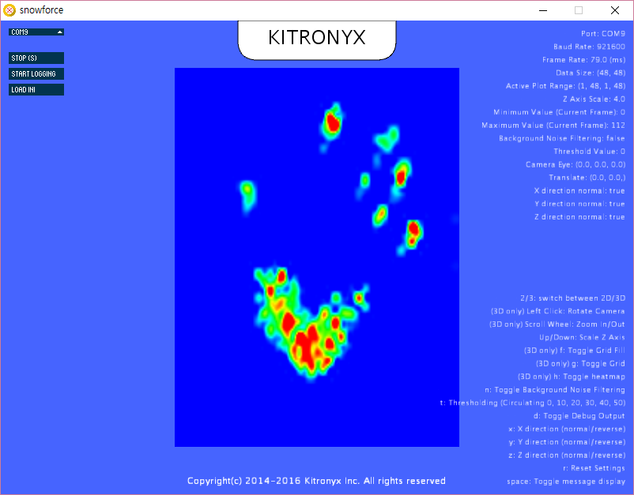

Processing visualization app for Kitronyx Snwoboard
===================================================

This app will visualize 3D force mapping from your Snowboard.

General
-------

This app will first try to communicate with Snowboard on COM port indicated by `snowboard_1610.ini`. If COM port is not available or Snowboard does not respond, it will show a 3D image with arbitrary signal strength.

### Quick Start
See
* http://sites.kitronyx.com/wiki/applications/snowforce
* http://sites.kitronyx.com/wiki/snowboard/examples/snowforce-code-to-read-force-matrix-sensor

DEVELOPMENT ENVIRONMENT
-----------------------
* Processing 3.0a5 (http://www.processing.org)
* ControlP5 Library 2.0.4 (www.sojamo.de/libraries/controlP5/
* PeasyCam Library (http://mrfeinberg.com/peasycam/)

HELP
----

Just run app. Help will be shown in the lower right corner of GUI.

INI files
---------
* `snowboard_1610.ini` is default INI file and for matrix sensor 1610
* `snowboard_1007.ini` is for matrix sensor 1007
* `snowboard_ms9705_ma1004.ini` is for MS9705 and MS9712 with MA1004 adaptor.
* `mc1509_ms9712.ini` is for MC1509 controller combined with MS9712 (and MS9705) sensors.

INI configuration
-----------------

### `device`

`device` refers to "snowboard" or "mc1509".

### `ndrive`

`ndrive` is the number of lines of a matrix sensor connected to drive channels of Snowboard.

### `nsense`

`nsense` is the number of lines of a matrix sensor connected to sense channels of Snowboard.

### `activerange`

`activerange` indicates the the range of drive and sense lines to be visualized.

`activerange=min_drive,max_drive,min_sense,max_sense`

### `interpscale`

`interpscale` resizes the gathered force image.

* `interpscale = 1`

* `interpscale = 3`

* `interpscale = 5`

### `port`

`port` indicates the port number to which Snowboard is connected. `auto` will ask find the Snowboard in the first COM port found. For COM port n, the value will be `COMn`.

### `xdir`, `ydir`, and `zdir`

These indicate the direction of increasing values along axes. Available options are `true` and `false`

### `driveindex` and `senseindex`

These values indicate the mapping between a matrix sensor and drive/sense channels of Snowboard.

In the following example, 8th drive line is connected to the 1st drive channel of Snowboard.
`driveindex=8,9,10,11,12,13,14,15,7,6,5,4,3,2,1,0`